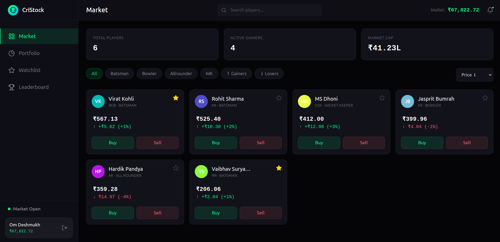
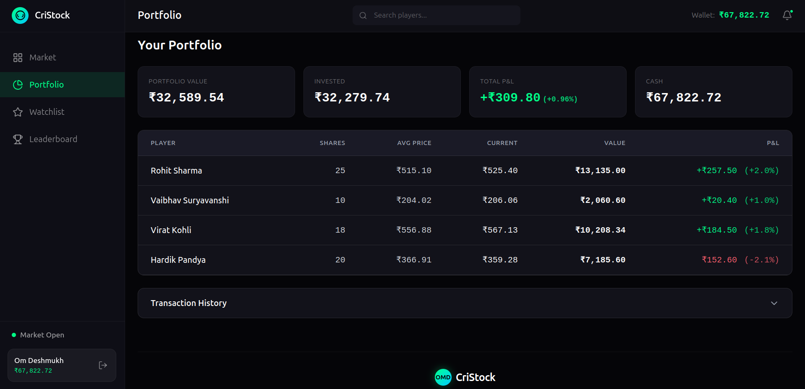
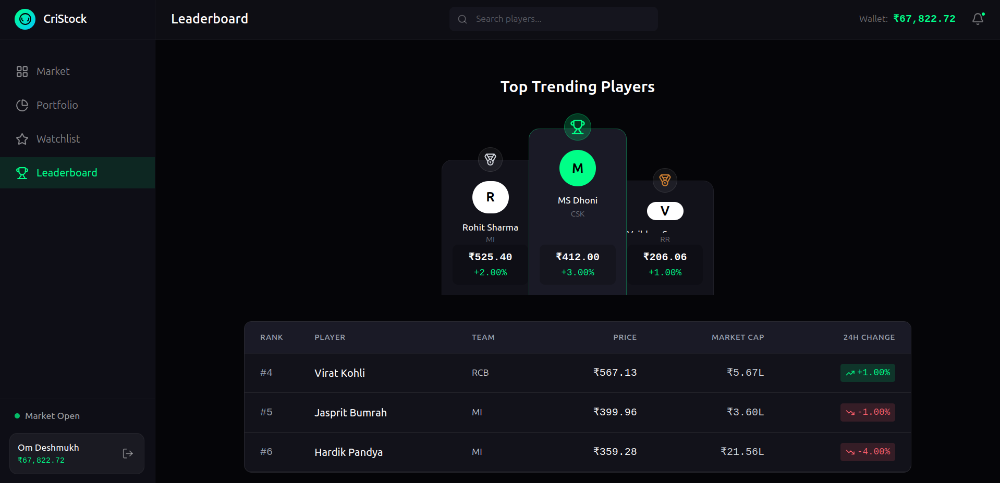
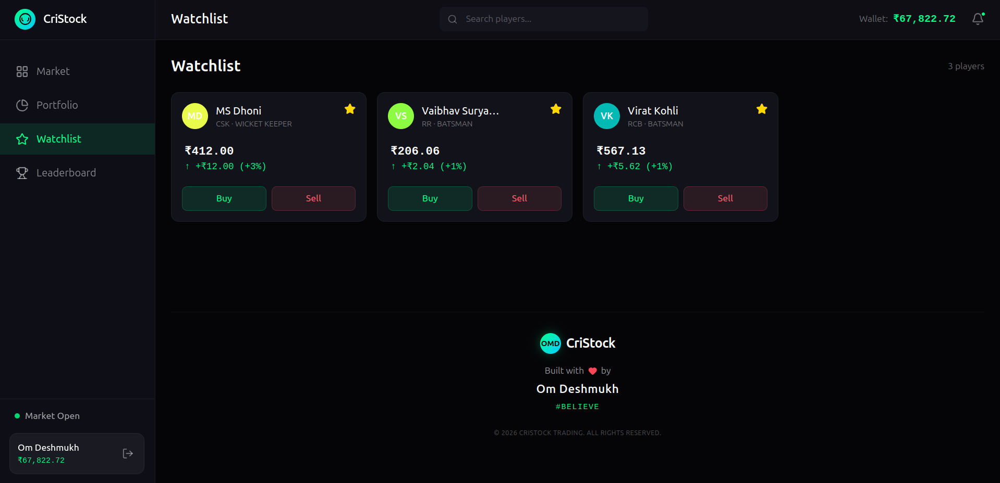
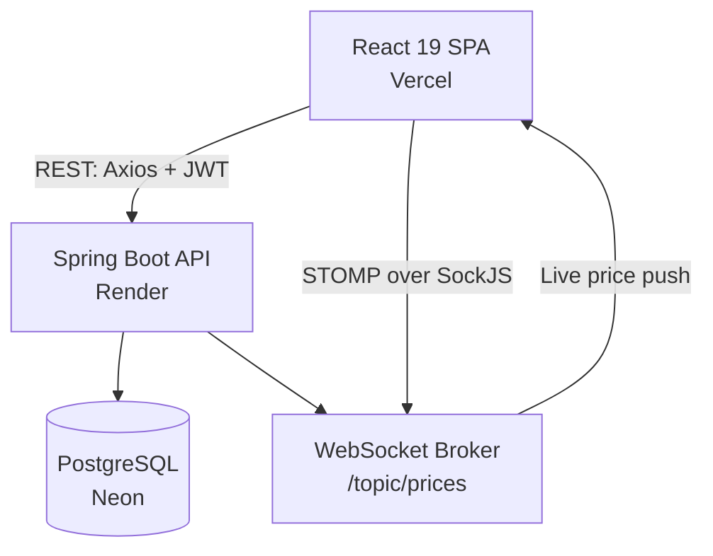

<h1 align="center">🏏 CriStock</h1>

<p align="center">
  <b>A real-time fantasy cricket stock exchange.</b><br/>
  Trade virtual shares of cricket players whose prices move on live demand and supply — not match points.
</p>

<p align="center">
  <a href="https://cristock.vercel.app"></a>
  <a href="#"></a>
  <a href="#"></a>
</p>

<p align="center">
  
  
  
  
  
  
  
  
  
</p>

<p align="center">
  📈 Real-time price engine &nbsp;•&nbsp; 💰 Live wallet & portfolio P/L &nbsp;•&nbsp; 🏆 Leaderboards &nbsp;•&nbsp; 🔐 JWT auth &nbsp;•&nbsp; 📊 Price history charts
</p>

---

## 🔗 Quick Links

| Resource | Link |
|---|---|
| 🌐 Live Application | [cristock.vercel.app](https://cristock.vercel.app) |
| ⚙️ Backend Host | [cristock-backend-url](https://cristock-8hkx.onrender.com) |
| 🗄️ Database | Neon (Serverless PostgreSQL) |
| 📖 API Docs (Swagger) | [Documentation](https://cristock-8hkx.onrender.com/swagger-ui/index.html) |

---

## Table of Contents

- [Why CriStock?](#-why-cristock)
- [Features](#-features)
- [Screenshots](#-screenshots)
- [Architecture](#-architecture)
- [The Price Engine](#-the-price-engine)
- [Tech Stack](#-tech-stack)
- [Design Patterns Used](#-design-patterns-used)
- [Project Structure](#-project-structure)
- [API Reference](#-api-reference)
- [Database Schema](#-database-schema)
- [Security](#-security)
- [Local Setup](#-local-setup)
- [Docker](#-docker)
- [Deployment](#-deployment)
- [Roadmap](#-roadmap)
- [License](#-license)

---

## 🤔 Why CriStock?

Most fantasy cricket platforms award points based on real match performance. CriStock takes a different approach: it simulates an actual stock exchange where every player is a tradable asset, and **price is determined entirely by user trading activity** — not by overs bowled or runs scored.

Every buy order pushes a player's price up; every sell order pushes it down. The size of the move scales with order size, just like a real market reacting to volume. The result is a self-contained, demand-driven economy built entirely on top of user behavior.

---

## ✨ Features

| Feature | Description |
|---|---|
| 🔐 Authentication | JWT-based registration & login with BCrypt password hashing |
| 📈 Live Market | Real-time price updates pushed over WebSocket (STOMP + SockJS) |
| 💹 Trading Engine | Atomic buy/sell flow with wallet, holdings, and price-impact updates in a single transaction |
| 💼 Portfolio | Live holdings, average buy price, current value, and unrealized profit/loss |
| 📜 Transaction History | Full chronological log of every buy/sell |
| 📊 Price Charts | Historical price data per player across 1H / 1D / 1W / 1M timeframes |
| 🏆 Leaderboard | Top gainers, top losers, and top market cap, computed live |
| ⭐ Watchlist | Client-side tracking of favorite players |
| 🛠️ Admin Panel | Create/update/delete players, view all users, adjust user wallet balances |
| 📱 PWA | Installable as a Progressive Web App |
| 📖 API Docs | Auto-generated Swagger / OpenAPI 3 documentation |

---

## 📸 Screenshots

### 🏠 Market Dashboard
Live player cards with prices, % change (color-coded), and mini sparkline charts.



### 👤 Player Details
Individual player page with historical price chart and buy/sell actions.


### 💼 Portfolio
Wallet balance, total invested, current value, and live profit/loss.



### 🏆 Leaderboard
Top gainers, losers, and market cap rankings.



### ⭐ Watchlist
Quick access to tracked players.



---

## 🏗 Architecture

CriStock is a decoupled client-server system: a React SPA talks to a stateless Spring Boot REST + WebSocket API, backed by a managed PostgreSQL instance.



**Backend layering** follows a strict, traditional Spring layered architecture:

```
Controller  →  Service (interface)  →  ServiceImpl  →  Repository  →  Entity  →  PostgreSQL
                                              ↑
                                       DTOs in/out (request/response)
```

**Frontend** follows a component-based architecture with React Context for cross-cutting state:

```
main.jsx → App.jsx (Router)
              ├── AuthContext      (login/register/token state)
              ├── MarketContext    (REST fetch + live WebSocket merge)
              └── WatchlistContext (favorited players)
                       ↓
              Pages → Layout components → UI components
```

---

## 📊 The Price Engine

This is the core mechanic that makes CriStock a "stock market" rather than a simple shop. It lives in `PriceEngineServiceImpl`:

- **On every buy**: `percentageIncrease = max(1, quantity / 10)`. Price is multiplied by `(1 + percentageIncrease/100)`.
- **On every sell**: `percentageDecrease = max(1, quantity / 10)`. Price is multiplied by `(1 - percentageDecrease/100)`, with a hard floor of `₹1` so prices can never go negative or to zero.
- **Every price change** recalculates `marketCap = currentPrice × totalShares` and is broadcast instantly to all connected clients over `/topic/prices`.

In other words: a 50-share buy moves the price by 5%, a 3-share buy still moves it by the 1% minimum. Larger orders have proportionally larger market impact — a simplified but real order-flow-driven pricing model.

| Operation | Complexity |
|---|---|
| Price recalculation | O(1) |
| Buy/Sell validation | O(1) |
| Portfolio aggregation | O(n) — n = number of holdings |
| Leaderboard (gainers/losers) | O(n log n) — sort over active players |

---

## 🧰 Tech Stack

### Backend
- **Java 21**
- **Spring Boot 3.5.16** — application framework
- **Spring Data JPA / Hibernate** — ORM, `ddl-auto: update`
- **Spring Security** — stateless, role-based authorization
- **Spring WebSocket** + **STOMP** — real-time price broadcasting
- **PostgreSQL** (Neon, serverless) — primary datastore
- **JJWT 0.12.7** — JWT generation/validation (HS256)
- **springdoc-openapi 2.8.9** — Swagger UI / OpenAPI 3 docs
- **Lombok** — boilerplate reduction (`@Getter`, `@Builder`, etc.)
- **Jakarta Bean Validation** — request DTO validation
- **Maven** — build & dependency management

### Frontend
- **React 19**
- **Vite 8** — build tool & dev server
- **Tailwind CSS 4** — utility-first styling
- **React Router 7** — client-side routing
- **Axios** — HTTP client with JWT interceptor
- **@stomp/stompjs + sockjs-client** — WebSocket/STOMP client for live prices
- **Recharts** — price history & sparkline charts
- **lucide-react** — icon set
- **vite-plugin-pwa** — installable PWA support

### Infrastructure
- **Docker / Docker Compose** — local multi-container dev (Postgres + backend + frontend)
- **Vercel** — frontend hosting
- **Render** — backend hosting
- **Neon** — serverless PostgreSQL

**Why these choices?**
- *React* — component reuse and fast rendering for a UI with frequent, granular price updates.
- *WebSocket/STOMP over polling* — price changes are pushed the instant a trade happens, instead of clients repeatedly asking the server.
- *PostgreSQL* — money-moving operations (wallet debits, share transfers) need ACID guarantees; a relational DB with transactions is the right fit.
- *Stateless JWT* — keeps the backend horizontally scalable with zero server-side session state, which matters once frontend and backend live on separate platforms (Vercel/Render).
- *Neon (serverless Postgres)* — pairs naturally with a Render-hosted backend; no infrastructure to manage, scales to zero when idle.

---

## 🧩 Design Patterns Used

- **Layered Architecture** — Controller → Service → Repository separation
- **Repository Pattern** — Spring Data JPA repositories abstract persistence
- **Service Interface + Impl Pattern** — every service is defined as an interface (`TradingService`) with a dedicated implementation (`TradingServiceImpl`), enabling loose coupling and easier testing
- **DTO Pattern** — entities never cross the API boundary; dedicated `request`/`response` DTOs shape every payload
- **Builder Pattern** — Lombok `@Builder` used across entities and DTOs for safe, readable object construction
- **Dependency Injection** — constructor injection via `@RequiredArgsConstructor` throughout
- **Observer Pattern** — WebSocket pub/sub: `WebSocketServiceImpl` publishes; subscribed clients react
- **Global Exception Handling** — centralized `@ControllerAdvice` (`GlobalExceptionHandler`) mapping ~10 custom domain exceptions to clean HTTP error responses
- **Seeder / CommandLineRunner Pattern** — `AdminSeeder` bootstraps a default admin account on application startup

---

## 📂 Project Structure

```
CriStock/
├── backend/cristock/
│   └── src/main/java/com/cristock/
│       ├── config/          # AdminSeeder, SwaggerConfig, WebSocketConfig, PasswordConfig
│       ├── controller/      # Auth, Player, Trading, Leaderboard, Admin
│       ├── dto/
│       │   ├── request/     # LoginRequest, TradingRequest, CreatePlayerRequest, ...
│       │   └── response/    # AuthResponse, PortfolioResponse, LeaderboardResponse, ...
│       ├── entity/           # User, Player, Holding, Transaction, PriceHistory
│       ├── enums/            # Role, PlayerRole, TransactionType, MarketStatus
│       ├── exception/        # GlobalExceptionHandler + 9 domain exceptions
│       ├── repository/       # Spring Data JPA repositories
│       ├── security/         # JwtService, JwtAuthenticationFilter, SecurityConfig
│       └── service/          # Interfaces + impl/ subpackage
│
└── frontend/cristock-frontend/
    └── src/
        ├── api/               # axios.js, players.js, portfolio.js, trading.js
        ├── components/
        │   ├── layout/        # AppLayout, TopBar, Sidebar, BottomNav, Footer
        │   ├── modals/        # BuyModal, SellModal
        │   └── ui/            # PlayerCard, MiniChart, PriceBadge, StatCard
        ├── context/           # AuthContext, MarketContext, WatchlistContext
        ├── hooks/             # useWebSocket, usePriceFlash
        └── pages/             # Login, Register, Market, PlayerDetail, Portfolio, Leaderboard, Watchlist
```

---

## 🔌 API Reference

Base URL: `https://cristock-8hkx.onrender.com/api`

### Auth — public

**POST `/auth/register`**
```json
// Request
{ "fullName": "John Doe", "email": "john@gmail.com", "password": "password123" }

// Response
{ "token": "eyJhbGciOi...", "type": "Bearer", "userId": 1, "fullName": "John Doe", "email": "john@gmail.com", "role": "USER" }
```

**POST `/auth/login`**
```json
// Request
{ "email": "john@gmail.com", "password": "password123" }

// Response
{ "token": "eyJhbGciOi...", "type": "Bearer", "userId": 1, "fullName": "John Doe", "email": "john@gmail.com", "role": "USER" }
```

### Players — GET public, write ADMIN-only

| Method | Endpoint | Description |
|---|---|---|
| GET | `/players` | List all players |
| GET | `/players/{id}` | Single player detail |
| GET | `/players/{id}/chart?timeframe=1D` | Price history (`1H`, `1D`, `1W`, `1M`) |
| POST | `/players` | Create player *(ADMIN)* |
| PUT | `/players/{id}` | Update player *(ADMIN)* |
| DELETE | `/players/{id}` | Delete player *(ADMIN)* |

### Trading — requires `Authorization: Bearer <token>`

**POST `/trading/buy`**
```json
// Request
{ "playerId": 1, "quantity": 10 }

// Response
{ "transactionId": 55, "playerName": "V. Kohli", "type": "BUY", "quantity": 10, "price": 252.50, "totalAmount": 2525.00, "timestamp": "2026-06-30T10:15:00" }
```

**POST `/trading/sell`** — same shape as `/buy`, `type: "SELL"`

**GET `/trading/portfolio`** → wallet balance, invested amount, current value, profit/loss, full holdings list

**GET `/trading/history`** → chronological transaction list

### Leaderboard — public

| Method | Endpoint | Description |
|---|---|---|
| GET | `/leaderboard/gainers` | Top 10 players by % price increase |
| GET | `/leaderboard/losers` | Top 10 players by % price decrease |
| GET | `/leaderboard/market-cap` | Top 10 players by market cap |

### Admin — `ADMIN` role only

| Method | Endpoint | Description |
|---|---|---|
| GET | `/admin/users` | List all registered users |
| PATCH | `/admin/users/addbalance` | Adjust a user's wallet balance |

### WebSocket

Connect via SockJS to `/ws`, then subscribe to `/topic/prices` for live `PriceUpdateResponse` broadcasts after every trade.

---

## 🗄 Database Schema

5 core tables, all timestamped (`created_at` / `updated_at`):

| Table | Key Columns | Notes |
|---|---|---|
| `users` | `email` (unique), `password` (BCrypt), `wallet_balance`, `role` | Default wallet: ₹100,000 |
| `players` | `name` (unique), `team`, `role`, `current_price`, `previous_price`, `total_shares`, `available_shares`, `market_cap`, `active` | Market cap auto-computed on save |
| `holdings` | `user_id` + `player_id` (unique pair), `shares`, `average_buy_price` | One row per user-player position |
| `transactions` | `user_id`, `player_id`, `type` (BUY/SELL), `quantity`, `price`, `total_amount` | Immutable trade log |
| `price_history` | `player_id`, `price`, `recorded_at` | Indexed on `(player_id, recorded_at DESC)` for fast chart reads |

Relationships: `User 1—N Holding N—1 Player`, `User 1—N Transaction N—1 Player`, `Player 1—N PriceHistory`.

---

## 🔐 Security

- **Stateless JWT authentication** — `SessionCreationPolicy.STATELESS`, no server-side session state
- **BCrypt** password hashing via `PasswordConfig`
- **Role-based authorization** enforced at the `SecurityFilterChain` level (`USER` / `ADMIN`)
- **CORS** explicitly restricted to the deployed frontend origin only
- **JwtAuthenticationFilter** runs once per request, validates the `Bearer` token, and populates the Spring Security context
- **Centralized exception handling** — invalid input, insufficient funds/shares, missing resources, and auth failures all return structured, predictable error responses instead of leaking stack traces

---

## 💻 Local Setup

### Prerequisites
- Java 21
- Node.js 18+
- PostgreSQL (or use Docker Compose, see below)
- Maven (or use the included `mvnw` wrapper)

### Backend
```bash
cd backend/cristock

# Set the required environment variables (or use an application-local.yaml)
export DB_URL=jdbc:postgresql://localhost:5432/cristock_db
export DB_USERNAME=postgres
export DB_PASSWORD=yourpassword
export JWT_SECRET=<a-base64-encoded-secret-key>
export JWT_EXPIRATION=86400000
export ADMIN_EMAIL=admin@cristock.com
export ADMIN_PASSWORD=admin123
export FRONTEND_URL=http://localhost:5173

./mvnw spring-boot:run
```
Backend runs on `http://localhost:8080`. Swagger UI: `http://localhost:8080/swagger-ui/index.html`.

### Frontend
```bash
cd frontend/cristock-frontend
npm install

# .env
echo "VITE_API_BASE_URL=http://localhost:8080/api" > .env

npm run dev
```
Frontend runs on `http://localhost:5173`.

---

## 🐳 Docker

A full stack (Postgres + backend + frontend) is defined in `docker-compose.yml`:

```bash
docker compose up --build
```

| Service | Port |
|---|---|
| PostgreSQL | `5433 → 5432` |
| Backend | `8080` |
| Frontend | `80` |

Environment variables (`DB_USERNAME`, `DB_PASSWORD`, `JWT_SECRET`, etc.) can be overridden via a `.env` file in the project root.

---

## ☁️ Deployment

| Layer | Platform | Notes |
|---|---|---|
| Frontend | **Vercel** | Auto-deployed from the `frontend/cristock-frontend` directory; `VITE_API_BASE_URL` points to the Render backend |
| Backend | **Render** | Spring Boot app built via Maven, `SPRING_PROFILE=prod`, env vars for DB/JWT/admin/CORS |
| Database | **Neon** | Serverless PostgreSQL, connected via `DB_URL`/`DB_USERNAME`/`DB_PASSWORD` |

CORS on the backend is locked to the production frontend origin (`https://cristock.vercel.app`), and the WebSocket endpoint accepts connections only from configured allowed origins.

---

## 🛣 Roadmap

**Phase 1 — Done**
- ✅ JWT Authentication & role-based access
- ✅ Real-time trading engine with dynamic pricing
- ✅ Portfolio tracking with live P/L
- ✅ WebSocket price broadcasting
- ✅ Leaderboards & admin panel

**Phase 2 — Planned**
- ⬜ Database migrations via Flyway (currently `ddl-auto: update`)
- ⬜ Rate limiting on trading endpoints
- ⬜ Redis caching for leaderboard/market-cap queries
- ⬜ Automated test suite (unit + integration)
- ⬜ Real cricket match data integration for event-driven price shocks

**Phase 3 — Future**
- ⬜ Kafka-based event streaming for price updates
- ⬜ AI-assisted price prediction
- ⬜ Social/competitive trading features
- ⬜ Native mobile app

---

<p align="center">
  <b>🏏 CriStock</b> — built with Spring Boot, React, and an unhealthy interest in market mechanics.
</p>

<p align="center">
  <a href="https://cristock.vercel.app">Live App</a> •
  <a href="https://github.com/omd-believe/CriStock">Repository</a> •
  <a href="https://github.com/omd-believe/CriStock/issues">Report a Bug</a> •
  <a href="https://github.com/omd-believe">@omd-believe</a>
</p>

<p align="center">
  <sub>If this project helped you or you found it interesting, consider giving it a ⭐ — it genuinely helps visibility.</sub>
</p>
